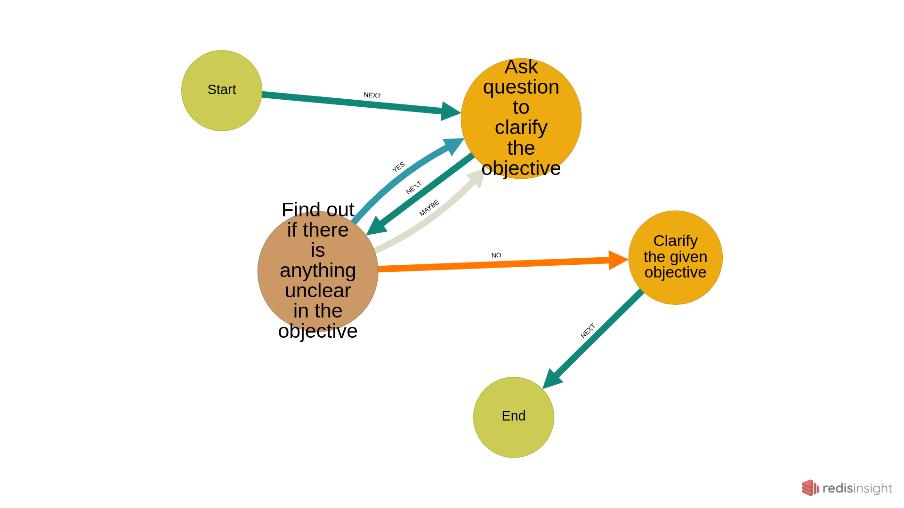

# HybridAGI Library

This repository is dedicated to providing a comprehensive collection of `.cypher` files for building and leveraging the power of [HybridAGI](https://github.com/SynaLinks/HybridAGI). These `.cypher` files enable you to design and implement sophisticated AGI systems.

## About HybridAGI

HybridAGI represents the fusion of advanced Artificial General Intelligence (AGI) technologies with hybrid architectures that combine the strengths of both machine learning models and explicit programming. This approach aims to bridge the gap between the impressive language generation abilities of large language models and the need for logical reasoning and decision-making capabilities. By integrating advanced machine learning models with explicit programming, HybridAGI systems excel in language generation, logical reasoning, and decision-making tasks.

## Repository Contents

The HybridAGI Library primarily consists of a wide range of `.cypher` files, each file representing a unique program or a component of a larger HybridAGI system. These files are carefully designed to empower your AGI system with the ability to follow logical paths, make decisions, and execute actions using external tools.

# Getting Started

To start, simply clone or download this repository to your local machine, if you installed HybridAGI successfully, the library should be already installed. You can then browse through the different sections and explore the available `.cypher` files. Feel free to modify, combine, and customize these files to suit your specific requirements and objectives. 

### Introducing Hybrid AGI Graph Programs

Hybrid AGI graph programs are programs represented as property graphs, which serve as a guiding structure for the behavior of the system. These programs consist of nodes and relationships that dictate the sequence of actions, decisions, and sub-programs to be executed. By leveraging the Graph-Of-Prompt paradigm, Hybrid AGI gains the ability to make probabilistic decisions and use external tools effectively.

### The Graph Program Schema

To design and understand Hybrid AGI graph programs, let's explore the schema used in these programs:

#### Labels:

- Control: Represents a control point, such as the start or end of the program.
- Action: Represents an action involving the use of a LangChain tool.
- Decision: Represents a decision-making point.
- Program: Represents a sub-program within the graph memory.

#### Properties:

- Control:
  - name: The name of the control point (Start or End).
- Action:
  - name: The purpose of the action.
  - tool: The tool to use for executing the action.
  - params: The prompt used to infer the parameters of the tool.
- Decision:
  - name: The purpose of the decision.
  - question: The question to ask or the decision to be made.
- Program:
  - name: The purpose of the sub-program.
  - program: The index of the program within the graph memory.

#### Relationship types:

- NEXT: Represents the sequential order of actions and decisions.
- And any other relationship types needed by the decision-making process.

### Decisions in Graph Programs

Decisions play a crucial role in Hybrid AGI graph programs by facilitating choices and branching paths. Each decision node offers options represented by outgoing edges, enabling diverse possibilities for decision-making. Whether it's a classic YES/NO scenario, a multi-classification choice, or even adding a MAYBE option, decisions provide the flexibility for AGI to follow logical paths within its program. Decisions can also be utilized as conditional loops, allowing for iterative processes and adaptive behavior.

### Actions in Graph Programs

Actions in Hybrid AGI graph programs involve the use of [Langchain tools](https://python.langchain.com/docs/modules/agents/tools/) by the agent. The choice of the tool and its purpose is defined within the program itself, while the parameters of the tool are inferred from the prompt. By incorporating various actions, Hybrid AGI gains the capability to interact with external systems and perform specific tasks.

#### The `Predict` tool

The `Predict` tool is a special keyword to make a prediction based on a prompt and the current state of the program, its purpose is to populate the prompt with anything usefull for the task.

#### HybridAGI tools

You have access to the following tools:

- *AskUser*:
    Usefull to ask User for additionnal information.
    The Observation is from the perspective of the User responding to you.
    
- *Speak*:
    Usefull to tell information to the User.
    
- *WriteFile*:
    Usefull when you want to write into a new file.
    The Input should be the target path followed by the data to write.
    Both parameters needs to be double quoted without punctuation between them.
    
- *UpdateFile*:
    Usefull when you want to modify an existing file using your own LLM.
    The Input should be the target path followed by the modifications to make.
    Both parameters needs to be double quoted without punctuation between them.
    
- *ReadFile*:
    Usefull when you want to read or check an existing file.
    The input should be the target path.
    Display one chunk at a time, use multiple times with the same target to scroll.
    
- *Upload*:
    Usefull to upload a folder or file to the User.
    The Input should be the target path.

- *VirtualShell*:
    Usefull to navigate into your hybrid database and organize it.
    You can use the following commands to interact with your hybrid memory: ['cd', 'ls', 'mkdir', 'mv', 'pwd', 'rm']
    You can only use ONE COMMAND AT A TIME, piping, redirection and multiple commands are NOT supported.
    Use the parameter --help for more information about the command usage.

### Understanding Limitations

While Hybrid AGI graph programs offer powerful capabilities, it's important to consider their limitations. One such limitation arises from the maximum size constraint of the prompt, which impacts the working memory of the system. Handling complex tasks efficiently requires the ability to save and retrieve information effectively.

### Your First Graph Programs

To get started with Hybrid AGI graph base prompt programming, let's dive into your first program! Below is a minimal example that demonstrates the backbone of a graph program:

```do_nothing.cypher
CREATE
(start:Control {name: "Start"}),  // The starting point of the program
(end:Control {name: "End"}),      // The ending point of the program
(start)-[:NEXT]->(end)            // The end follows the start, resulting in no action
```

In this program, we have only defined the starting point and ending point, effectively doing nothing. Let's now enhance the program by adding an action:

```hello_world.cypher
CREATE
(start:Control {name: "Start"}),
(say_hello:Action {name: "Greet the User", tool: "Speak", params: "Say hello in {language}\nSpeak:"}),
(end:Control {name: "End"}),
(start)-[:NEXT]->(say_hello),
(say_hello)-[:NEXT]->(end)
```

In the updated program, we have introduced an action called "Greet the User" utilizing the "Speak" tool. The parameters for this action are inferred from the prompt, allowing AGI to greet the user in their preferred language.

To further enhance the program, we can incorporate decision-making:

```clarify_objective.cypher
CREATE
(start:Control {name: "Start"}),
(ask_question:Action {name:"Ask question to clarify the objective", tool:"AskUser", params:"Pick one question to clarify the objective and ask it in {language}\nQuestion:"}),
(is_anything_unclear:Decision {name:"Find out if there is anything unclear in the objective", question:"Is there anything unclear in the objective?"}),
(end:Control {name: "End"}),
(start)-[:NEXT]->(ask_question),
(ask_question)-[:NEXT]->(is_anything_unclear),
(is_anything_unclear)-[:YES]->(ask_question),
(is_anything_unclear)-[:NO]->(end)
```

In this program, we introduce a decision point to clarify the objective. If there is something unclear, the AGI will ask the user for clarification repeatedly until the objective is clear. Once the objective is clear, the program will proceed to the end.

To make the decision-making process more robust and consider uncertainty, we can expand the options for decision outcomes:

```clarify_objective.cypher
CREATE
(start:Control {name:"Start"}),
(ask_question:Action {name:"Ask question to clarify the Objective", tool:"AskUser", params:"Pick one question to clarify the Objective and ask it in {language}\nQuestion:"}),
(is_anything_unclear:Decision {name:"Find out if there is anything unclear in the Objective", question:"Is there still anything unclear in the Objective? Let's think this out in a step by step way to be sure we have the right answer"}),
(clarify:Action {name:"Clarify the given objective", tool:"Predict", params:"The refined Objective considering all AskUser Observations.\nObjective:"}),
(end:Control {name:"End"}),
(start)-[:NEXT]->(ask_question),
(ask_question)-[:NEXT]->(is_anything_unclear),
(is_anything_unclear)-[:MAYBE]->(ask_question),
(is_anything_unclear)-[:YES]->(ask_question),
(is_anything_unclear)-[:NO]->(clarify),
(clarify)-[:NEXT]->(end)
```

In this enhanced program, we incorporate the "step-by-step" thinking approach to ensure a clear objective. The decision node allows for a MAYBE option in addition to YES and NO, providing more flexibility in handling uncertainty. The refined objective is then obtained through the "Predict" tool.

Here is the visual representation of this program:


To use this behavior within other programs, we can create sub-programs:

```main.cypher
CREATE
(start:Control {name: "Start"}),
(clarify_objective:Program {name:"Clarify the objective given by the User", program:"program:clarify_objective"}),
(end:Control {name: "End"}),
(start)-[:NEXT]->(clarify_objective),
(clarify_objective)-[:NEXT]->(end)
```

In this example, the main program incorporates the sub-program "clarify_objective" This modularity allows for the reuse and composition of different program components to achieve more complex behaviors.

## Contribution Guidelines

Contributions to the HybridAGI Library are highly encouraged and appreciated. If you have created novel Cypher files, improved existing programs, or developed utility functions that can benefit the HybridAGI community, we welcome your contributions.

## Support and Feedback

If you need assistance or have questions regarding the HybridAGI Library, feel free to open an issue in the repository. We also appreciate any feedback or suggestions you may have to improve the library and make it more valuable for the community.

Let's unlock the true potential of HybridAGI together with the HybridAGI Library. Happy programming and exploring the realms of Artificial General Intelligence!